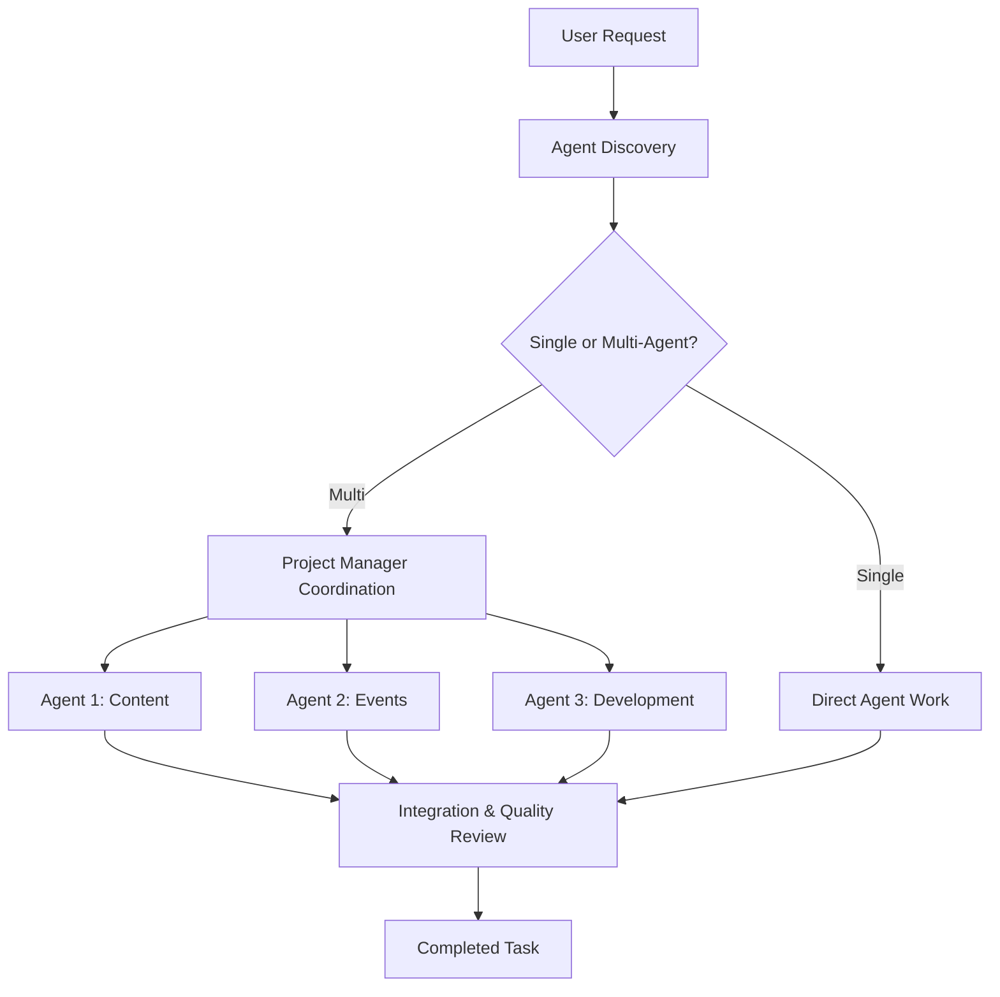

# LusoTown Agent System Guide

The LusoTown project includes a comprehensive system of specialized AI agents designed to assist with Portuguese community-specific development tasks. This guide explains how to effectively utilize these agents for optimal development outcomes.

## 🤖 Agent Overview

Our agent system consists of **16 specialized agents** organized into three categories:

### Portuguese Community Specialists (8 agents)
- **luso-content-agent** - Portuguese translation and cultural content
- **luso-events-agent** - Portuguese cultural events curation
- **luso-safety-agent** - Community moderation and safety
- **luso-business-agent** - Portuguese business directory
- **luso-growth-agent** - Community growth and SEO
- **luso-heritage-agent** - Heritage preservation and storytelling
- **luso-membership-agent** - Membership optimization
- **luso-partnership-agent** - Institutional partnerships

### Development Specialists (5 agents)
- **bug-finder** - Quality assurance and testing
- **deploy-manager** - Production deployment
- **doc-writer** - Documentation specialist
- **feature-builder** - Feature development
- **refactor-helper** - Code optimization

### Design & Management (3 agents)
- **project-manager-agent** - Project coordination
- **ui-specialist** - User interface design
- **ux-specialist** - User experience design

## 🔍 How to Use Agents

### Method 1: Natural Language Requests (Recommended)

Simply describe your task using natural language and mention the relevant specialty:

```
"I need to translate the events page to Portuguese with cultural authenticity."
→ System will recommend: luso-content-agent

"Help me create a Santos Populares festival event in London."
→ System will recommend: luso-events-agent

"Review the community guidelines for cultural sensitivity."
→ System will recommend: luso-safety-agent
```

### Method 2: Agent Discovery Tool

Use the agent discovery tool to find the right agent for your task:

```bash
# Find agents for a specific task
node .claude/invoke-agent.js "translate content to portuguese"

# List all available agents
node .claude/invoke-agent.js --list

# Get details about a specific agent
node .claude/invoke-agent.js --agent luso-content-agent
```

### Method 3: Direct Agent Request

Request a specific agent by name or specialty:

```
"Please use the Portuguese content specialist to help translate this content."
"I need the Portuguese events curator to help plan this cultural event."
"Use the community safety agent to review this content for appropriateness."
```

## 📋 Agent Quick Reference

### 🇵🇹 Portuguese Community Tasks

| Task Type | Recommended Agent | Example Use |
|-----------|------------------|-------------|
| **Translation** | luso-content-agent | "Translate the pricing page to Portuguese" |
| **Cultural Events** | luso-events-agent | "Create a Fado night event" |
| **Content Moderation** | luso-safety-agent | "Review forum posts for guidelines compliance" |
| **Business Directory** | luso-business-agent | "Add Portuguese restaurant profiles" |
| **Community Growth** | luso-growth-agent | "Optimize SEO for Portuguese keywords" |
| **Cultural Stories** | luso-heritage-agent | "Document community success stories" |
| **Membership** | luso-membership-agent | "Improve sign-up conversion rates" |
| **Partnerships** | luso-partnership-agent | "Connect with Portuguese Embassy" |

### 💻 Development Tasks

| Task Type | Recommended Agent | Example Use |
|-----------|------------------|-------------|
| **Bug Testing** | bug-finder | "Test the event feed functionality" |
| **Deployment** | deploy-manager | "Plan production deployment strategy" |
| **Documentation** | doc-writer | "Update API documentation" |
| **New Features** | feature-builder | "Implement event booking system" |
| **Code Quality** | refactor-helper | "Optimize component performance" |

### 🎨 Design Tasks

| Task Type | Recommended Agent | Example Use |
|-----------|------------------|-------------|
| **Project Planning** | project-manager-agent | "Coordinate multi-agent feature development" |
| **Visual Design** | ui-specialist | "Improve event card styling" |
| **User Experience** | ux-specialist | "Optimize user registration flow" |

## 🔗 Agent Coordination

### Multi-Agent Tasks

For complex tasks requiring multiple specialties, use the **project-manager-agent** to coordinate:

```
"I need to create a comprehensive Portuguese cultural festival feature. 
Please coordinate the content, events, safety, and development agents to:
1. Plan the festival events (luso-events-agent)
2. Create Portuguese content (luso-content-agent) 
3. Implement safety guidelines (luso-safety-agent)
4. Build the technical features (feature-builder)
5. Document the implementation (doc-writer)"
```

### Agent Workflow Example



## 🎯 Best Practices

### 1. **Be Specific About Portuguese Context**
```
❌ "Translate this page"
✅ "Translate this page to Portuguese with Brazilian and European variants"
```

### 2. **Mention Cultural Requirements**
```
❌ "Create an event"
✅ "Create a Portuguese cultural event appropriate for families"
```

### 3. **Specify London Context**
```
❌ "Find Portuguese businesses"
✅ "Find verified Portuguese businesses in London for the directory"
```

### 4. **Request Quality Assurance**
```
❌ "Deploy the feature"
✅ "Deploy the feature after testing with Portuguese community guidelines"
```

## 🔧 Agent System Architecture

### Agent Registry (`agents.json`)
Central registry containing all agent configurations, specialties, and matching patterns.

### Discovery System (`invoke-agent.js`)
Intelligent matching system that recommends appropriate agents based on task description.

### Integration Points
- **Claude Code Integration**: Seamless agent invocation through natural language
- **Context Awareness**: All agents receive full project context
- **Quality Gates**: Consistent validation across all agent work

## 📊 Agent Performance Metrics

### Success Indicators
- **Task Completion Rate**: % of tasks successfully completed by appropriate agents
- **Cultural Authenticity**: Portuguese community validation of agent output
- **Development Efficiency**: Reduction in development time through specialized agents
- **Quality Metrics**: Code quality, documentation completeness, test coverage

### Monitoring
- Agent usage patterns and effectiveness
- Task completion success rates
- Community feedback on agent-generated content
- Development velocity improvements

## 🚀 Getting Started

1. **Identify Your Task**: Clearly describe what you need to accomplish
2. **Find the Right Agent**: Use the discovery tool or natural language
3. **Provide Context**: Include Portuguese community requirements
4. **Review Results**: Ensure cultural authenticity and quality
5. **Coordinate Multi-Agent**: Use project manager for complex tasks

## 📞 Support & Feedback

- **Agent Issues**: Report through project-manager-agent
- **New Agent Requests**: Suggest through project planning
- **Cultural Validation**: Use luso-content-agent or luso-safety-agent
- **Performance Feedback**: Track through project metrics

---

**Remember**: The agent system is designed to enhance, not replace, human judgment. Always review agent output for cultural authenticity and quality, especially for Portuguese community content.

*Last Updated: August 14, 2025*